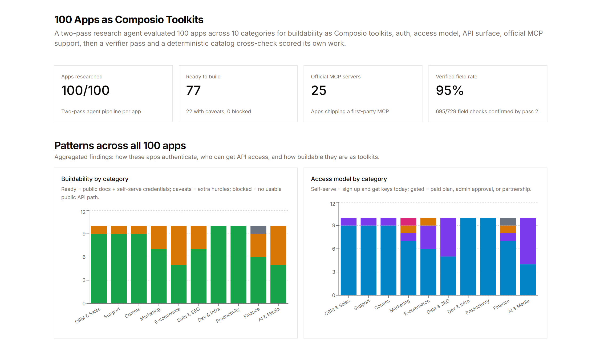

# Composio AI Product Ops Intern: take-home assignment

Research agent that evaluates ~100 apps as potential Composio toolkits (auth, self-serve vs gated, API surface, MCP, buildability), then a case study of patterns and verification.

**Status: Complete.** Part 1 delivers the research agent, Convex store, catalog baseline, and per-app table/detail UI. Part 2 delivers the reviewer-facing case study: patterns across all 100 apps, a measured human sample audit, and a live HTML page.



## What Part 1 covers

For each app the agent captures:

- Category and a one-line description
- Auth methods (OAuth2, API key, Basic, token, other)
- Access model (self-serve, paid plan, admin approval, partnership)
- API surface (REST / GraphQL / SDK / MCP, breadth)
- Official MCP yes/no
- Buildability (`ready` / `caveats` / `blocked`) plus a blocker if any
- Docs URL, per-claim citations, evidence notes
- Catalog cross-check against the `data/` Composio snapshot (67 in catalog, 33 absent)

The UI is a sortable table of the 100 apps. Opening a row shows the verdict, findings, verification, catalog baseline, and workflow traces.

## Stack

- [Convex](https://convex.dev/) — database, workflow, actions
- [Next.js](https://nextjs.org/) + React — table / case-study app
- [Exa](https://exa.ai/) — docs search and page contents
- Kimi K3 via Modal (OpenAI-compatible) — structured extraction and verify pass
- [Tailwind](https://tailwindcss.com/) — UI

## How to run

```bash
bun install
bun run dev
```

That starts `convex dev` and `next dev` together. Open the app URL Next prints (usually `http://localhost:3000`).

Use `npx convex dev` for the backend during development. Do **not** use `npx convex deploy` except for production.

### Environment

Copy into `.env.local` (values are not committed):

```bash
CONVEX_DEPLOYMENT=          # from `npx convex dev`
NEXT_PUBLIC_CONVEX_URL=
NEXT_PUBLIC_CONVEX_SITE_URL=

EXA_API_KEY=
MODAL_PROXY_TOKEN_ID=
MODAL_PROXY_TOKEN_SECRET=
```

Modal env vars are set on the Convex deployment as well (`npx convex env set …`) so actions can call Kimi.

### Seed (once per deployment)

From the Convex dashboard or CLI:

```bash
npx convex run seed:seedAll
# or separately:
npx convex run catalog:seedCatalogBaseline '{"force":true}'
```

`data/` markdown snapshots are parsed into `composioCatalog`. Absence of a file is a real signal: the agent must not invent a Composio toolkit for those 33 apps.

### Run the research agent

1. Open `/`.
2. Click an app row.
3. Press **Run** / **Re-run**.
4. Watch status on the table (`queued` → `running` → `completed` / `failed`).
5. In the detail panel: verdict, findings, verify pass, catalog baseline, and expandable execution steps.

Each run is a durable Convex workflow (`convex/research.ts`). Re-runs keep the last few workflow IDs for history.

To research all untouched records, use **Run remaining** beside the table filter and confirm the count. The action queues only apps with `not_started` status; completed, failed, queued, and running records are left unchanged. Progress is shown in the toolbar, and failed records can be retried individually from their row.

## Agent pipeline

```text
load app
→ Exa search (API-reference URLs ranked above OAuth-only pages)
→ LLM pass 1: structured extraction (Kimi K3, JSON schema)
→ fetch primary docs + auth page (skip JS-only junk)
→ LLM pass 2: verify against the full corpus, not a single page
→ deterministic Composio catalog compare
→ write findings + verification
```

Pass 2 only overwrites a field when the corpus **contradicts** pass 1. Incomplete evidence (e.g. an OAuth page that does not list REST objects) is not treated as “unknown API.” Auth-product migrations such as Salesforce Connected Apps → External Client Apps are stored as a setup note, not a demotion from `ready` to `caveats`.

LLM calls use a raised token budget, `finish_reason` checks, JSON salvage, and retries on truncation / rate limits.

## Verification (built into Part 1)

Accuracy loop that already exists:

1. **First pass** — Exa snippets → structured fields + citations.
2. **Second pass** — re-fetch docs, per-field confirmed/revised notes, confidence.
3. **Catalog check** — no LLM. Flags e.g. Composio ships an MCP toolkit while the agent said `hasOfficialMcp=false`, or catalog lists OAuth2 while the agent omitted it.

Human review is included as a sample audit: open the live docs URL, score hits/misses, and report how accuracy moved between passes.

## Known limitations

- Exa `/contents` sometimes returns client telemetry JS instead of rendered docs. Those fetches are discarded and the search corpus is used instead.
- Workflow IDs expire in Convex; missing runs show as `expired` rather than crashing the panel.
- The live research results depend on the configured Convex deployment and external documentation providers.

## Part 2: Case study and audit

The reviewer-facing case study is complete and includes:

- All 100 apps researched via the table's **Run remaining** bulk action.
- `analysis:patterns` query aggregates auth mix, access by category, buildability, blockers, catalog agreement, easy wins vs outreach, and pass-2 verification stats.
- Optional `audit` field on apps plus `audit:recordAudit` / `audit:clearAudit` mutations and an `audit:suggestSample` query for the human sample audit.
- Root page case study: TL;DR stats, pattern charts, agent pipeline explanation, and verification/audit section above the live table.
- Human audits recorded for the suggested sample and surfaced in the verification section.

---

## Original brief (research set)

Composio turns apps into tools agents can call. This set is 100 apps across 10 categories so the interesting work is the patterns, not any single row.

### 1. CRM and Sales

| #   | App        | Website / hint               |
| --- | ---------- | ---------------------------- |
| 1   | Salesforce | salesforce.com               |
| 2   | HubSpot    | hubspot.com                  |
| 3   | Pipedrive  | pipedrive.com                |
| 4   | Attio      | attio.com                    |
| 5   | Twenty     | twenty.com (open-source CRM) |
| 6   | Podio      | podio.com                    |
| 7   | Zoho CRM   | zoho.com/crm                 |
| 8   | Close      | close.com                    |
| 9   | Copper     | copper.com                   |
| 10  | DealCloud  | api.docs.dealcloud.com       |

### 2. Support and Helpdesk

| #   | App        | Website / hint |
| --- | ---------- | -------------- |
| 11  | Zendesk    | zendesk.com    |
| 12  | Intercom   | intercom.com   |
| 13  | Freshdesk  | freshdesk.com  |
| 14  | Front      | front.com      |
| 15  | Pylon      | usepylon.com   |
| 16  | LiveAgent  | liveagent.com  |
| 17  | Plain      | plain.com      |
| 18  | Help Scout | helpscout.com  |
| 19  | Gorgias    | gorgias.com    |
| 20  | Gladly     | gladly.com     |

### 3. Communications and Messaging

| #   | App               | Website / hint                        |
| --- | ----------------- | ------------------------------------- |
| 21  | Slack             | slack.com                             |
| 22  | Twilio            | twilio.com                            |
| 23  | Zoho Cliq         | zoho.com/cliq                         |
| 24  | Lark (Larksuite)  | open.larksuite.com                    |
| 25  | Pumble            | pumble.com                            |
| 26  | Discord           | discord.com                           |
| 27  | Telegram          | core.telegram.org                     |
| 28  | WhatsApp Business | developers.facebook.com/docs/whatsapp |
| 29  | Aircall           | aircall.io                            |
| 30  | Vonage            | developer.vonage.com                  |

### 4. Marketing, Ads, Email and Social

| #   | App            | Website / hint                              |
| --- | -------------- | ------------------------------------------- |
| 31  | Google Ads     | developers.google.com/google-ads            |
| 32  | Meta Ads       | developers.facebook.com/docs/marketing-apis |
| 33  | LinkedIn Ads   | learn.microsoft.com/linkedin/marketing      |
| 34  | GoHighLevel    | highlevel.stoplight.io                      |
| 35  | Mailchimp      | mailchimp.com/developer                     |
| 36  | Klaviyo        | developers.klaviyo.com                      |
| 37  | systeme.io     | systeme.io (funnel builder)                 |
| 38  | Pinterest      | developers.pinterest.com                    |
| 39  | Threads (Meta) | developers.facebook.com/docs/threads        |
| 40  | SendGrid       | sendgrid.com                                |

### 5. Ecommerce

| #   | App                       | Website / hint                                |
| --- | ------------------------- | --------------------------------------------- |
| 41  | Shopify                   | shopify.dev                                   |
| 42  | WooCommerce               | woocommerce.com/document/woocommerce-rest-api |
| 43  | BigCommerce               | developer.bigcommerce.com                     |
| 44  | Salesforce Commerce Cloud | developer.salesforce.com/docs/commerce        |
| 45  | Magento (Adobe Commerce)  | developer.adobe.com/commerce                  |
| 46  | Squarespace               | developers.squarespace.com                    |
| 47  | Ecwid                     | api-docs.ecwid.com                            |
| 48  | Gumroad                   | gumroad.com/api                               |
| 49  | Amazon Selling Partner    | developer-docs.amazon.com/sp-api              |
| 50  | fanbasis                  | fanbasis.com                                  |

### 6. Data, SEO and Scraping

| #   | App          | Website / hint                       |
| --- | ------------ | ------------------------------------ |
| 51  | DataForSEO   | docs.dataforseo.com                  |
| 52  | SE Ranking   | seranking.com/api                    |
| 53  | Ahrefs       | ahrefs.com/api                       |
| 54  | MrScraper    | docs.mrscraper.com                   |
| 55  | Apify        | docs.apify.com                       |
| 56  | Firecrawl    | firecrawl.dev                        |
| 57  | Bright Data  | brightdata.com                       |
| 58  | Sherlock     | github.com/sherlock-project/sherlock |
| 59  | Waterfall.io | waterfall.io (contact/company intel) |
| 60  | Clay         | clay.com                             |

### 7. Developer, Infra and Data platforms

| #   | App           | Website / hint                |
| --- | ------------- | ----------------------------- |
| 61  | GitHub        | docs.github.com/rest          |
| 62  | Vercel        | vercel.com/docs/rest-api      |
| 63  | Netlify       | docs.netlify.com/api          |
| 64  | Cloudflare    | developers.cloudflare.com/api |
| 65  | Supabase      | supabase.com/docs             |
| 66  | Neo4j         | neo4j.com/docs/api            |
| 67  | Snowflake     | docs.snowflake.com            |
| 68  | MongoDB Atlas | mongodb.com/docs/atlas/api    |
| 69  | Datadog       | docs.datadoghq.com/api        |
| 70  | Sentry        | docs.sentry.io/api            |

### 8. Productivity and Project Management

| #   | App        | Website / hint                              |
| --- | ---------- | ------------------------------------------- |
| 71  | Notion     | developers.notion.com                       |
| 72  | Airtable   | airtable.com/developers                     |
| 73  | Linear     | developers.linear.app                       |
| 74  | Jira       | developer.atlassian.com                     |
| 75  | Asana      | developers.asana.com                        |
| 76  | Monday.com | developer.monday.com                        |
| 77  | ClickUp    | clickup.com/api                             |
| 78  | Coda       | coda.io/developers                          |
| 79  | Smartsheet | smartsheet.com/developers                   |
| 80  | Harvest    | harvestapp.com (help.getharvest.com/api-v2) |

### 9. Finance and Fintech

| #   | App             | Website / hint               |
| --- | --------------- | ---------------------------- |
| 81  | Stripe          | stripe.com/docs/api          |
| 82  | Plaid           | plaid.com/docs               |
| 83  | Binance         | binance-docs.github.io       |
| 84  | Paygent Connect | paygent (NMI-powered)        |
| 85  | iPayX           | ipayx.ai/docs                |
| 86  | QuickBooks      | developer.intuit.com         |
| 87  | Xero            | developer.xero.com           |
| 88  | Brex            | developer.brex.com           |
| 89  | Ramp            | docs.ramp.com                |
| 90  | PitchBook       | pitchbook.com (research API) |

### 10. AI, Research and Media-native

| #   | App                | Website / hint                           |
| --- | ------------------ | ---------------------------------------- |
| 91  | NotebookLM         | cloud.google.com/gemini (Enterprise API) |
| 92  | Otter AI           | help.otter.ai (MCP server)               |
| 93  | Fathom             | fathom.video                             |
| 94  | Consensus          | consensus.app (OAuth requested)          |
| 95  | Reducto            | reducto.ai (document parsing)            |
| 96  | Devin              | docs.devin.ai (MCP)                      |
| 97  | higgsfield         | higgsfield.ai/cli (content suite)        |
| 98  | Mermaid CLI        | github.com/mermaid-js/mermaid-cli        |
| 99  | YouTube Transcript | transcriptapi.com                        |
| 100 | Grain              | grain.com (meeting notes)                |

## Ground truth: Composio catalog snapshot

`data/` is a snapshot of [Composio toolkit docs](https://docs.composio.dev/toolkits) for apps in this set. The agent compares its findings to it (already a toolkit? auth / MCP kind line up?).

### How the files were collected

1. Download `https://docs.composio.dev/toolkits.md`.
2. Parse display name, URL slug, and `SLUG`.
3. Match the 100 apps by name / slug (aliases: GoHighLevel → `highlevel`, WhatsApp Business → `whatsapp`).
4. If matched: `https://docs.composio.dev/toolkits/{slug}.md` → `data/{slug}.md`.
5. No catalog row → no file. Absence is a check: do not invent a toolkit.

### Coverage

- **67 in catalog** under `data/`.
- **33 not in catalog:** Podio, Copper, DealCloud, Front, LiveAgent, Gladly, Twilio, Zoho Cliq, Lark, Aircall, Vonage, systeme.io, Threads, WooCommerce, BigCommerce, Salesforce Commerce Cloud, Magento, Squarespace, Ecwid, Amazon Selling Partner, fanbasis, SE Ranking, Sherlock, Waterfall.io, MongoDB Atlas, Smartsheet, Binance, Paygent Connect, iPayX, PitchBook, Reducto, Mermaid CLI, Grain.

Matching notes:

- Some apps are **MCP toolkits** only (`pylon_mcp`, `netlify_mcp`, `plaid_mcp`, `otter_ai_mcp`, `devin_mcp`, `higgsfield_mcp`).
- **Zoho CRM** maps to generic `zoho`, not `zoho_crm`.
- **Mermaid CLI** was not saved; the catalog has [Mermaid Chart MCP](https://docs.composio.dev/toolkits/mermaid_chart_mcp.md), a different product.
